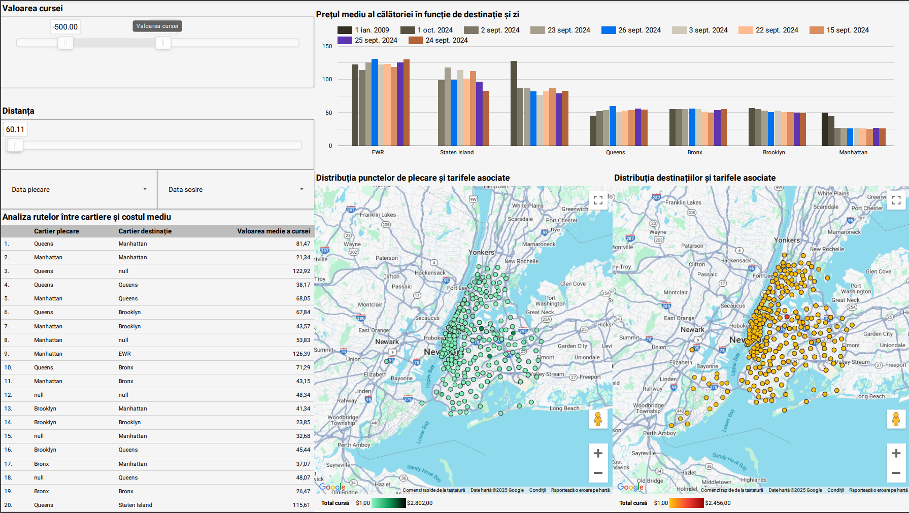

# NYC Taxi Fare Prediction Pipeline

## Obiective

### O1 - Colectarea și pregătirea datelor pentru stocare

#### preprocess_and_data_storage.py
- **Descărcarea datelor**:
  - Descărcarea fișierului PARQUET corespunzător lunii și anului specificat dintr-o sursă externă.
  - URL-ul fișierului este construit dinamic folosind `BASE_URL`.
- **Preprocesarea datelor**:
  - Eliminarea atributelor cu mai mult de 50% date lipsă.
  - Eliminarea rândurilor cu valori lipsă pentru atributele rămase.
- **Încărcarea datelor preprocesate în Google Cloud Storage**:
  - Verificarea existenței bucket-ului GCS și crearea acestuia, dacă este necesar.
  - Încărcarea fișierului preprocesat în bucket-ul specificat.

---

### O2 - Stocarea datelor în soluții de stocare care să permită procesarea lor

#### preprocess_and_data_storage.py
- **Crearea unui dataset BigQuery**:
  - Verificarea existenței dataset-ului BigQuery și crearea acestuia, dacă este necesar.
- **Importul datelor în BigQuery**:
  - Datele preprocesate sunt importate într-un tabel BigQuery pentru utilizare ulterioară.

#### constants.py
- **Definirea constantelor pentru stocare**:
  - `BUCKET_NAME`: Numele bucket-ului Google Cloud Storage.
  - `PROJECT_ID`: ID-ul proiectului Google Cloud.
  - `DATASET_ID`: ID-ul dataset-ului BigQuery.
  - `TABLE_ID`: Numele tabelului BigQuery.
  - `JSON_KEY`: Calea către cheia de autentificare pentru GCP.

---

### O3 - Construcția scenariilor de analiză

#### fare_amount_prediction.py
- **Filtrarea și pregătirea datelor**:
  - Crearea unui tabel filtrat (`filtered_tripdata`) cu cursele relevante, excluzând valorile anormale (e.g., distanțe prea mici sau tarife eronate).
- **Împărțirea datelor în seturi de antrenare și testare**:
  - `training_data` (80% din date) pentru antrenarea modelului.
  - `testing_data` (20% din date) pentru evaluarea modelului.
- **Crearea modelului de predicție a tarifelor**:
  - Antrenarea unui model de regresie liniară (`LINEAR_REG`) pentru a prezice tariful unei curse (`fare_amount`) pe baza caracteristicilor relevante.
- **Evaluarea modelului**:
  - Calcularea metodelor de performanță (e.g., mean absolute error, R² score) pentru evaluarea predicțiilor.

#### Vizualizare și analiză

- **Etapele parcurse pentru integrarea și vizualizarea în Looker**:
  - **Pornirea de la tabelul din BigQuery**:
    - Datele preprocesate și importate în BigQuery au fost validate pentru a se asigura că sunt corect structurate și pregătite pentru utilizare analitică.
    - Colegul meu a efectuat analiza inițială direct în BigQuery, folosind interogări SQL pentru a verifica corectitudinea datelor și pentru a crea un subset relevant pentru vizualizare.
  - **Conexiunea dintre BigQuery și Looker**:
    - Am configurat conexiunea dintre BigQuery și Looker, utilizând setările specifice GCP pentru autentificare și acces sigur la date.
    - Modelul de date în Looker a fost creat pe baza tabelului din BigQuery, definind metrici cheie (e.g., medii, sume) și dimensiuni relevante (e.g., locațiile de pick-up și drop-off, tarifele și distanțele).
  - **Crearea vizualizărilor în Looker**:
    - Am construit dashboard-uri interactive care oferă perspective asupra tarifelor curselor de taxi din New York City.

- **Analiza raportului vizual**:
  - **Slider pentru valoarea cursei**:
    - Permite filtrarea curselor pe baza valorii tarifelor. De exemplu, cursele cu valori anormale (negative sau foarte mari) pot fi excluse pentru o analiză mai precisă.
  - **Slider pentru distanță**:
    - Oferă posibilitatea de a analiza cursele în funcție de distanța parcursă, identificând corelații între distanță și valoarea cursei.
  - **Prețul mediu al călătoriei în funcție de destinație și zi**:
    - Diagrama cu bare arată variația prețurilor medii pe diferite locații de destinație (e.g., Queens, Bronx, Manhattan). 
    - Compară zile specifice, evidențiind eventuale sezonalități sau fluctuații în cerere (e.g., tarife mai mari în anumite zile).
  - **Distribuția punctelor de plecare și tarifele asociate**:
    - Harta interactivă arată locațiile de pick-up ale curselor, codificate în culori în funcție de tariful asociat.
    - Punctele sunt distribuite dens în Manhattan și Queens, sugerând o activitate intensă de taxi în aceste zone.
  - **Distribuția destinațiilor și tarifele asociate**:
    - Similar cu harta punctelor de plecare, acest grafic arată destinațiile finale ale curselor, evidențiind locațiile populare.
  - **Analiza rutelor între cartiere și costul mediu**:
    - Tabelul afișează principalele rute între cartiere (e.g., Queens → Manhattan, Manhattan → Bronx), împreună cu valoarea medie a cursei.
    - De exemplu, rutele din Queens spre Manhattan au o valoare medie de 81.47, indicând tarife mai mari comparativ cu rutele interne din Manhattan.

- **Rezultatul final**:
  - Dashboard-ul din Looker oferă o vedere clară asupra datelor, fiind util pentru identificarea trendurilor, optimizarea rutelor și analiza comportamentului clienților.
  - Posibilitatea de a explora datele în mod interactiv oferă flexibilitate utilizatorilor non-tehnici, sprijinind luarea deciziilor bazate pe date.
